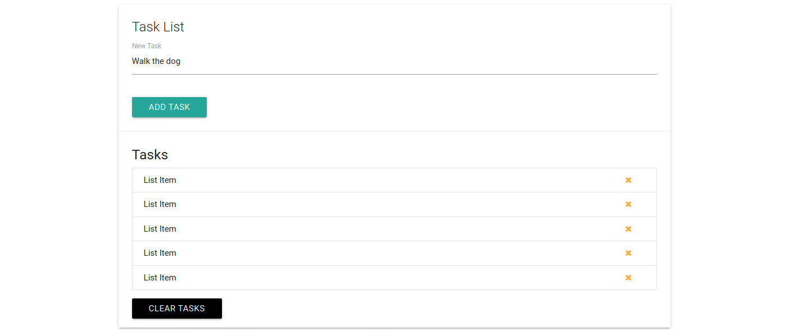

# Learning Modern JavaScript

- Use vanilla JavaScript instead of JQuery
- Use vanilla JavaScript to manipulate the DOM element
    - `index.html` is a dummy ToDO List page which is decorated using bootstrap font awesome and materialize css

## Preview of the index.html

### Notes
Element Ids must be unique in HTML. If need to select multiple elements, use a class instead

## getElementbyId vs querySelector
- Similarity
    1. Retrive element(s) from JS Document Object Model(DOM)

- Differences
    * querySelector
        - retrieve element from the DOM using CSS selector
    * getElementById 
        - retrieve element that is unique on a page